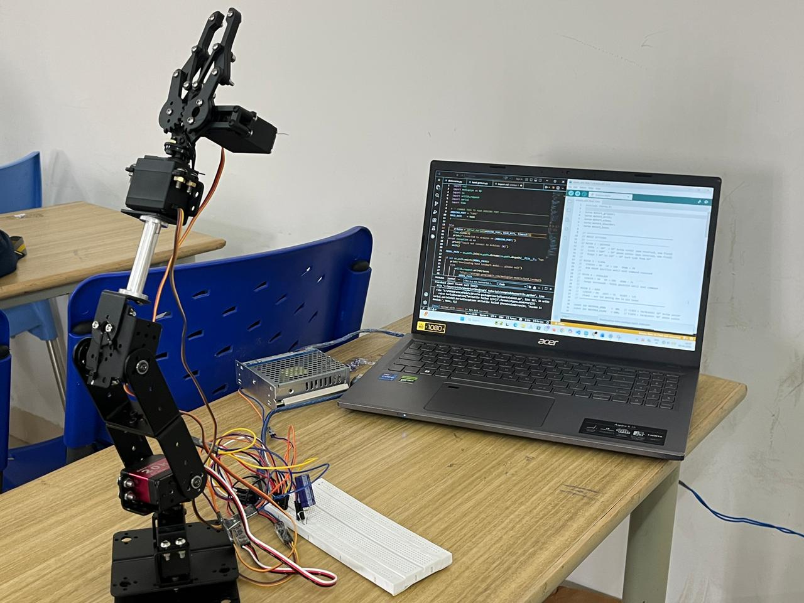
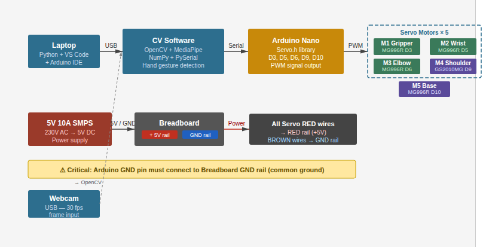
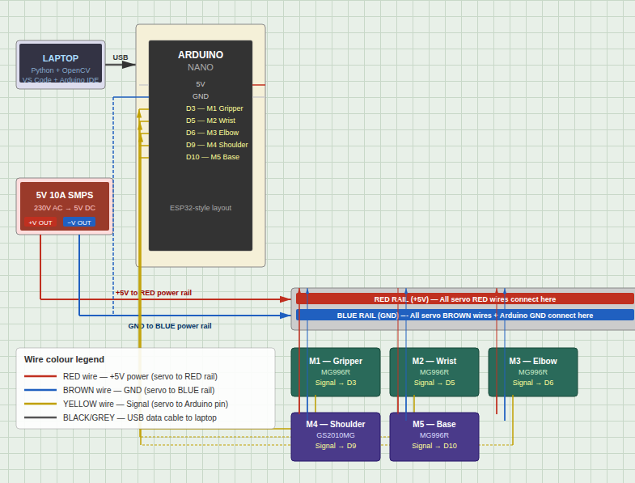
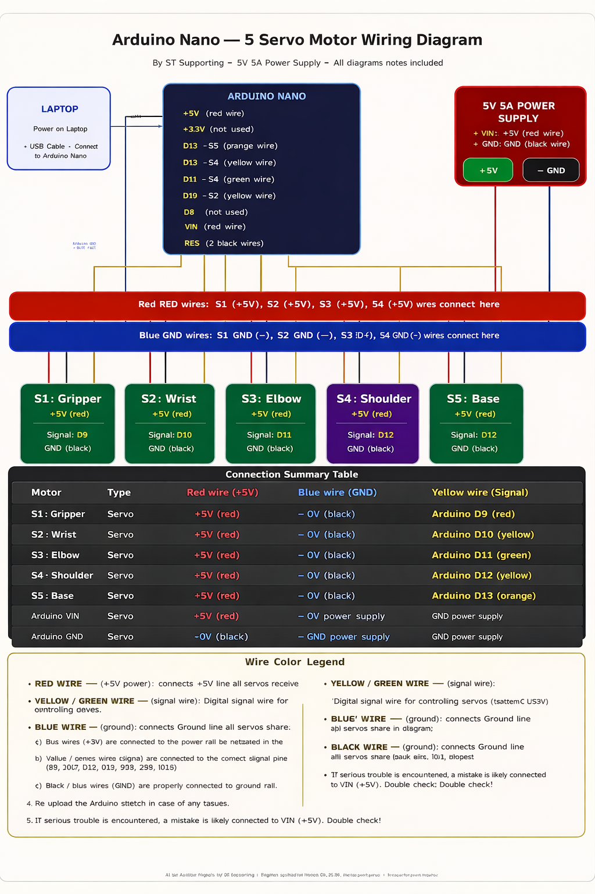
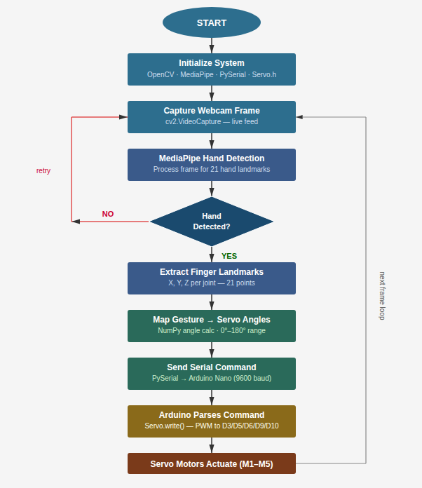
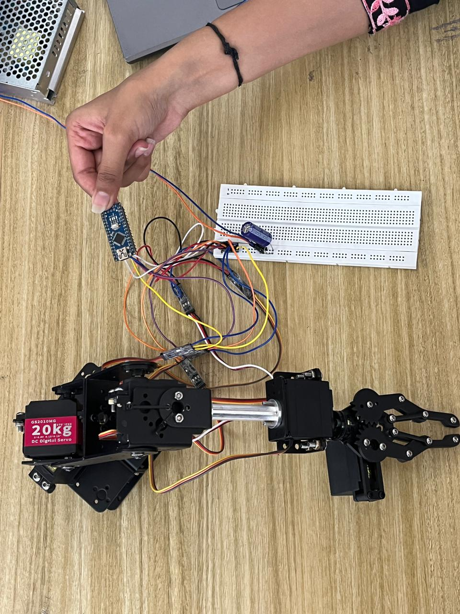
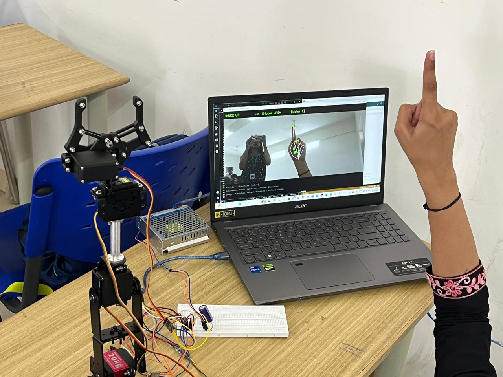
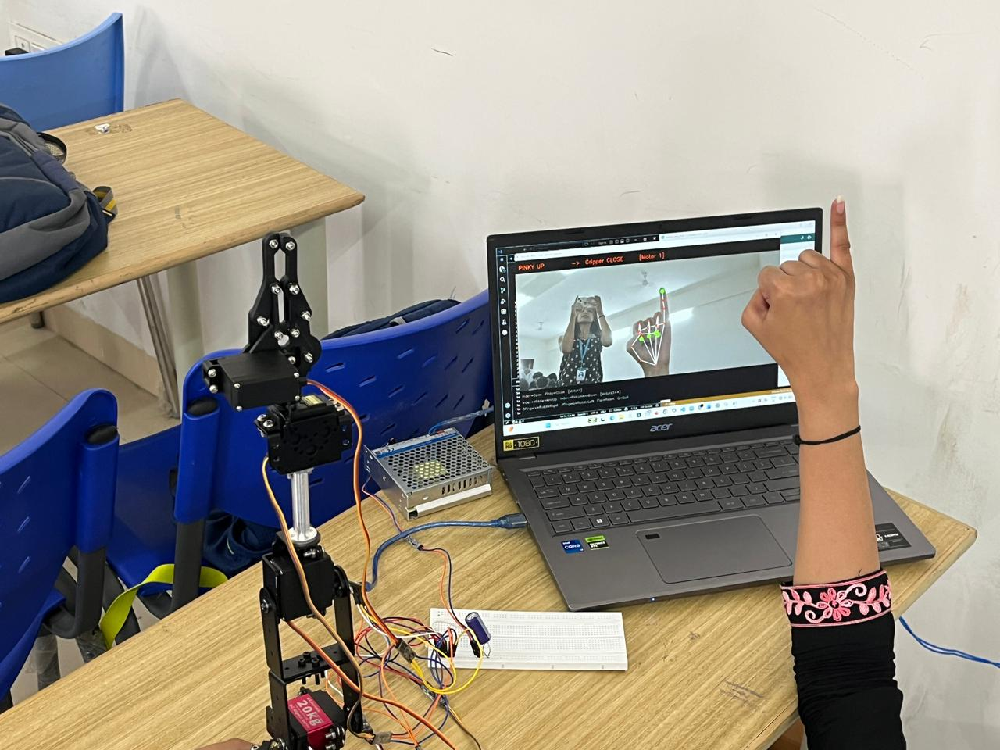
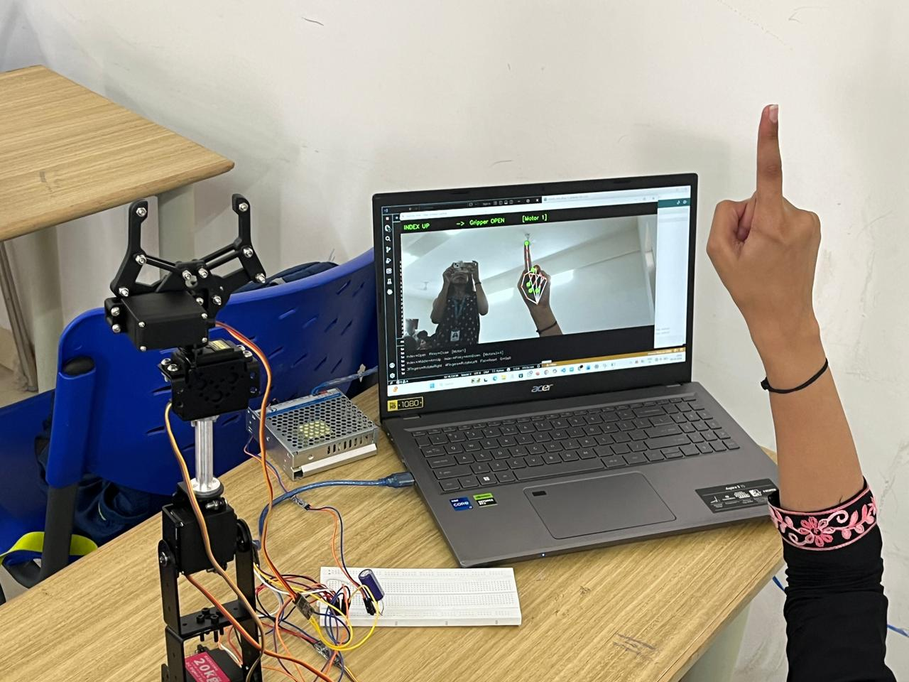

# Gesture Controlled Robotic Arm 🤖




A real-time gesture-controlled robotic arm using computer vision and embedded systems.
Hand gestures detected via webcam are translated into precise servo motor movements —
no joystick, no physical controller, completely contactless.

---

## 🌐 Live Project Website

🔗 https://diyasharma22.github.io/vision-based-gesture-controlled-robotic-arm/

---

## 📊 Performance Results

| Metric | Result |
|---|---|
| Gesture Recognition Latency | ~100ms real-time |
| Gestures Supported | 7 distinct hand gestures |
| Servo Motors Controlled | 5 (base, shoulder, elbow, wrist, gripper) |
| Serial Communication Speed | 9600 baud via PySerial |
| Detection Accuracy | ~90% under good lighting |
| Python–Arduino Latency | < 150ms end-to-end |

---

## ✋ Gesture Mapping

| Gesture | Action |
|---|---|
| ☝️ Index Finger Up | Gripper Open |
| 🤙 Pinky Finger Up | Gripper Close |
| ✌️ Index + Middle Finger Up | Arm Up |
| 🤘 Index + Pinky Up | Arm Down |
| 🤟 Three Fingers Up | Rotate Right |
| 🖐️ Four Fingers Up | Rotate Left |
| ✊ Fist | Reset All Motors |

---

## ⚙️ System Architecture



The webcam captures hand gestures in real time. OpenCV and MediaPipe process the video
feed and extract 21 hand landmarks per frame. Python maps landmark positions to gesture
commands and sends them to Arduino Nano over serial. Arduino translates each command
into PWM signals that drive the servo motors.

---

## 🔌 Circuit Connections



Hardware connections between laptop, Arduino Nano, servo motors, SMPS power supply,
and breadboard power rails.

---

## 🔧 Wiring Diagram



Servo motors connected to Arduino Nano PWM pins, powered by external 5V 10A SMPS.
Servos are powered independently from the SMPS — not from Arduino's onboard 5V pin —
to handle the combined current draw of 5 motors without browning out the microcontroller.

---

## 🔄 System Flowchart



---

## 🛠️ Hardware Components

| Component | Quantity | Purpose |
|---|---|---|
| Arduino Nano | 1 | Receives serial commands, drives servos via PWM |
| MG996R Servo Motors | 4 | Shoulder, elbow, wrist, base rotation |
| GS2010MG Servo Motor | 1 | Gripper open/close |
| 5V 10A SMPS | 1 | External power for all servos |
| Webcam | 1 | Real-time hand gesture capture |
| Breadboard | 1 | Power distribution rail |
| Jumper Wires | Multiple | Signal and power connections |

---

## 🔌 Servo Motor Pin Configuration

| Servo Function | Arduino Pin | Motor Model |
|---|---|---|
| Gripper | D3 | GS2010MG |
| Wrist | D5 | MG996R |
| Elbow | D6 | MG996R |
| Shoulder | D9 | MG996R |
| Base Rotation | D10 | MG996R |

---

## 🧠 Technologies Used

**Software:** Python · OpenCV · MediaPipe · PySerial · Arduino IDE  
**Hardware:** Arduino Nano · MG996R/GS2010MG Servos · 5V 10A SMPS · Webcam  
**Web:** HTML · CSS · GitHub Pages

---

## ▶️ Installation & Setup

### 1. Clone Repository
```bash
git clone https://github.com/diyasharma22/vision-based-gesture-controlled-robotic-arm.git
cd vision-based-gesture-controlled-robotic-arm
```

### 2. Install Python Dependencies
```bash
pip install -r python-code/requirements.txt
```
Or manually:
```bash
pip install opencv-python mediapipe pyserial numpy
```

### 3. Upload Arduino Code
1. Open Arduino IDE
2. Connect Arduino Nano via USB
3. Open `arduino-code/robotic_arm_control.ino`
4. Select board: **Arduino Nano**, correct COM port
5. Upload

### 4. Run the Gesture Controller
```bash
python python-code/gesture_control.py
```
Make sure to update the COM port in `gesture_control.py` to match your Arduino's port
(e.g., `COM3` on Windows, `/dev/ttyUSB0` on Linux).

---

## 📂 Repository Structure

```
vision-based-gesture-controlled-robotic-arm/
│
├── arduino-code/
│   ├── robotic_arm_control.ino   ← PWM servo control via serial commands
│   └── README.md
│
├── python-code/
│   ├── gesture_control.py        ← MediaPipe hand tracking + serial comm
│   ├── requirements.txt
│   └── README.md
│
├── images/                       ← Architecture diagrams, demo photos
├── index.html                    ← Project website
├── style.css
└── README.md
```

---

## 🔧 Technical Challenges & Solutions

**Servo synchronization delays**
Sending 5 servo commands sequentially over serial caused ~200ms stagger between first
and last motor movement, making the arm look jerky. Solved by batching all servo angles
into a single comma-separated serial packet parsed by Arduino in one loop cycle.

**Lighting sensitivity in gesture detection**
MediaPipe hand landmark confidence dropped significantly under uneven or dim lighting,
causing misdetections. Mitigated by adding a minimum confidence threshold filter
(0.75) and testing under consistent overhead lighting.

**Gesture detection noise / false triggers**
Rapid hand movements generated intermediate landmark positions that matched unintended
gestures. Added a 3-frame gesture confirmation buffer — the same gesture must be detected
in 3 consecutive frames before a command is sent.

**Servo power management**
Running all 5 servos from Arduino's onboard 5V caused voltage drops and random
microcontroller resets. Separated servo power supply — all servos powered directly from
the 5V 10A SMPS with a shared GND to Arduino.

**Mechanical calibration**
Servo horn mounting angles varied between assembly attempts, causing different zero
positions. Solved by writing a calibration routine in Arduino that sweeps each servo to
its centre position on startup before accepting gesture commands.

---

## 📷 Project Demonstration

### Full Robotic Arm Setup


### Gesture Recognition — Gripper Open


### Gesture Recognition — Gripper Close


### Real-Time Hand Landmark Detection


---

## 🧪 Working Principle

1. Webcam captures live video at 30fps
2. OpenCV reads each frame and passes it to MediaPipe
3. MediaPipe detects 21 hand landmarks per frame
4. Python checks which fingers are extended based on landmark Y-coordinates
5. Finger combination is matched against gesture mapping table
6. Matched gesture sends a command string over serial (e.g., `G:90,120,60,45,30`)
7. Arduino Nano parses the string and writes PWM values to each servo
8. Servo motors move the arm joints to target positions

---

## 🔮 Future Scope

- [ ] Wireless control via Bluetooth/WiFi (remove serial cable dependency)
- [ ] AI-based gesture learning — train custom gestures via ML model
- [ ] Two-hand gesture support for simultaneous multi-axis control
- [ ] Mobile app controller as alternative to webcam
- [ ] Object detection for autonomous pick-and-place
- [ ] AR/VR integration for remote robotic operation

---

## 🌍 Applications

Industrial Automation · Assistive Robotics · Human-Machine Interaction ·
Smart Manufacturing · Educational Robotics · Healthcare Robotics

---

## 👩‍💻 Team

| Name | Roll No | GitHub |
|---|---|---|
| Diya Sharma | 24BAC10047 | [@diyasharma22](https://github.com/diyasharma22) |
| Eipshita Basuli | 24BAC10038 | — |
| Richa Datta | 24BAC10073 | — |

**Institution:** VIT Bhopal University — B.Tech ECE (AI & Cybernetics)

---

## 📜 License

[MIT License](LICENSE) — Open for learning, academic reference, and innovation.
